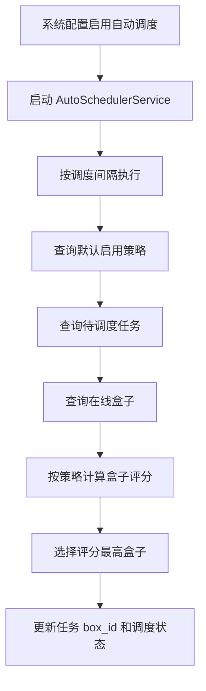
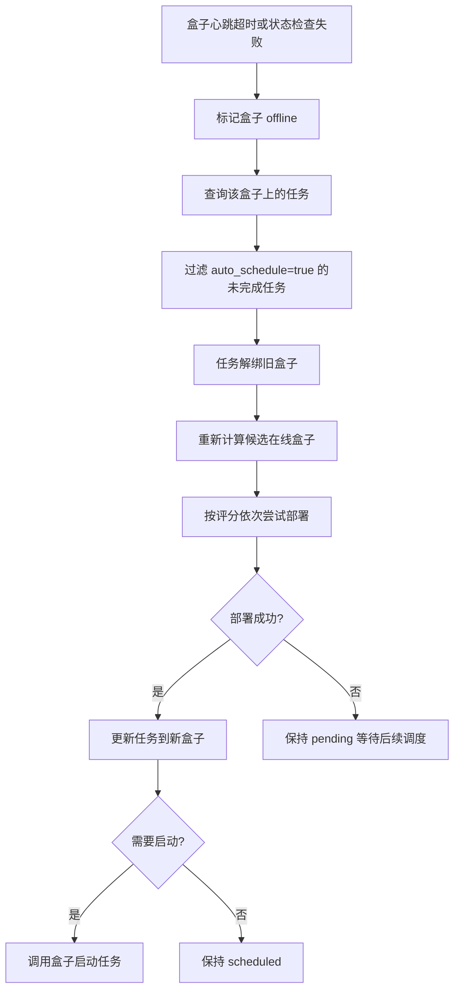

# 任务自动调度与故障转移说明

## 1. 目标

任务调度模块用于在多个在线 AI 盒子之间选择合适的盒子承载任务，并在盒子离线时，将符合条件的任务迁移到其他可用盒子，尽量保证任务持续运行。

当前实现包含两部分能力：

- 自动调度：定时扫描待调度任务，从在线盒子中选择一个合适盒子并分配任务。
- 故障转移：盒子离线后，自动处理该盒子上的自动调度任务，重新选择盒子并部署。

## 2. 核心概念

### 2.1 全局自动调度开关

系统配置项：

```text
task.auto_schedule_enabled
```

含义：

- `true`：服务启动后自动启动后台自动调度器；运行中修改配置也会同步启动调度器。
- `false`：停止后台自动调度器。

相关配置：

```text
task.schedule_interval_seconds
```

当调度策略没有配置 `trigger_conditions.interval_seconds`，会使用该系统配置作为默认调度间隔。

### 2.2 任务自动调度开关

任务字段：

```text
auto_schedule
```

含义：

- `true`：任务允许被自动调度器扫描、分配和故障转移。
- `false`：任务不会参与自动调度；关闭时如果任务已经分配盒子，会从盒子解绑。

### 2.3 任务调度状态

任务使用两组状态描述运行情况：

```text
status           旧版兼容状态
schedule_status  调度状态
run_status       运行状态
```

关键状态：

| 字段 | 值 | 含义 |
| --- | --- | --- |
| `schedule_status` | `unassigned` | 未分配盒子，可以被自动调度 |
| `schedule_status` | `assigned` | 已分配盒子 |
| `run_status` | `stopped` | 未运行 |
| `run_status` | `running` | 正在运行 |
| `status` | `pending` | 待处理，兼容旧逻辑 |
| `status` | `scheduled` | 已调度，兼容旧逻辑 |
| `status` | `running` | 运行中 |

任务分配盒子时会调用 `AssignToBox`：

```text
box_id = 目标盒子ID
schedule_status = assigned
status = scheduled
```

任务解绑盒子时会调用 `UnassignFromBox`：

```text
box_id = null
schedule_status = unassigned
run_status = stopped
status = pending
```

## 3. 自动调度流程

### 3.1 启动流程

服务启动后：

1. 初始化 `AutoSchedulerService`。
2. 初始化系统配置。
3. 读取 `task.auto_schedule_enabled`。
4. 如果开关为 `true`，启动自动调度循环。
5. 如果运行中修改系统配置，也会同步启动或停止自动调度器。

涉及代码：

```text
api/routes.go
service/system_config_service.go
service/auto_scheduler_service.go
```

### 3.2 定时调度流程

后台调度循环按间隔执行：

1. 获取默认启用调度策略。
2. 如果策略配置了 `trigger_conditions.interval_seconds`，优先使用策略间隔。
3. 否则使用系统配置 `task.schedule_interval_seconds`。
4. 查询待调度任务。
5. 查询在线盒子。
6. 根据策略选择盒子。
7. 更新任务分配状态。

待调度任务筛选条件：

```text
auto_schedule = true
schedule_status = unassigned
run_status = stopped
status not in (completed, cancelled, stopping)
```

相关代码：

```text
repository/task_repository.go
service/auto_scheduler_service.go
service/task_scheduler_service.go
```

### 3.3 调度策略

当前支持的策略类型：

| 策略类型 | 含义 |
| --- | --- |
| `priority` | 按任务优先级调度 |
| `load_balance` | 按盒子负载均衡调度 |
| `resource_match` | 按资源匹配度调度 |

调度评分会考虑：

- 盒子是否在线。
- 盒子当前活跃任务数。
- 每个盒子的最大任务数限制。
- CPU、内存、TPU 等资源阈值。
- 任务亲和性标签和盒子标签。
- 任务优先级。
- 硬件支持信息。

### 3.4 调度结果

自动调度成功后，任务会被分配到某个盒子：

```text
box_id = selected_box_id
schedule_status = assigned
status = scheduled
```

注意：自动调度主要负责“选择盒子并分配任务”。任务是否立即在盒子上启动，取决于后续部署/执行链路和任务自身配置。

如果通过任务执行服务执行任务，会进入完整流程：

1. 验证任务配置。
2. 调度到盒子。
3. 下发任务到盒子。
4. 监控执行状态。

相关代码：

```text
service/task_executor_service.go
service/task_deployment_service.go
```

## 4. 故障转移流程

### 4.1 触发条件

故障转移由盒子监控服务触发。

触发场景：

- 盒子心跳超过 5 分钟未更新。
- 盒子状态检查失败并被标记为离线。

相关代码：

```text
service/box_monitoring.go
```

### 4.2 离线检测流程

监控服务定时检查在线盒子：

1. 查询当前状态为 `online` 的盒子。
2. 判断 `last_heartbeat` 是否超过阈值。
3. 超时后将盒子状态更新为 `offline`。
4. 触发该盒子的任务故障转移。

### 4.3 任务故障转移筛选条件

盒子离线后，只迁移满足以下条件的任务：

```text
task.box_id = offline_box_id
task.auto_schedule = true
task.status not in (completed, cancelled, stopping)
```

以下任务不会自动迁移：

- 未开启自动调度的任务。
- 已完成任务。
- 已取消任务。
- 正在停止的任务。
- 不属于该离线盒子的任务。

### 4.4 迁移执行流程

故障转移执行步骤：

1. 查询离线盒子上的任务。
2. 过滤出允许故障转移的任务。
3. 将任务从旧盒子解绑，状态改为待调度。
4. 获取默认启用调度策略。
5. 调用调度服务重新计算候选盒子。
6. 按评分从高到低尝试新盒子。
7. 调用部署服务将任务下发到新盒子。
8. 迁移成功后清理任务错误信息。
9. 如果任务原来是运行中，或策略要求调度后自动启动，则尝试在新盒子启动任务。

故障转移不会等待旧盒子删除任务。原因是旧盒子已经离线，如果此时访问旧盒子，可能被网络超时拖慢恢复。系统优先保证任务尽快在新盒子恢复。

### 4.5 故障转移后的状态

迁移成功：

```text
box_id = new_box_id
schedule_status = assigned
status = scheduled 或 running
last_error = ""
```

迁移失败但已解绑：

```text
box_id = null
schedule_status = unassigned
run_status = stopped
status = pending
last_error = 故障转移失败原因
```

迁移失败后，任务保持待调度状态，后续自动调度循环仍可继续尝试。

### 4.6 自动启动规则

故障转移后是否启动任务，取决于以下条件：

- 任务原来处于运行状态；或
- 当前调度策略的 `execution_config.auto_start_task = true`。

如果任务自身 `auto_start = true`，部署到盒子时盒子端会按任务配置自动启动；管理端不会重复调用启动接口。

## 5. API 入口

### 5.1 自动调度器状态

```http
GET /api/v1/auto-scheduler/status
```

返回内容包含：

- 是否运行。
- 已调度数量。
- 失败数量。
- 启用策略数量。
- 待调度任务数量。
- 可用盒子数量。
- 调度间隔。

### 5.2 启动自动调度器

```http
POST /api/v1/auto-scheduler/start
```

### 5.3 停止自动调度器

```http
POST /api/v1/auto-scheduler/stop
```

### 5.4 手动触发调度

```http
POST /api/v1/auto-scheduler/trigger
```

### 5.5 指定策略触发调度

```http
POST /api/v1/auto-scheduler/trigger/{id}
```

### 5.6 查询自动调度任务

```http
GET /api/v1/tasks/auto-schedule
```

## 6. 关键配置

### 6.1 系统配置

| 配置项 | 说明 |
| --- | --- |
| `task.auto_schedule_enabled` | 是否启用自动调度器 |
| `task.schedule_interval_seconds` | 默认调度间隔 |
| `task.max_concurrent_per_box` | 每盒子最大并发任务数 |
| `task.default_priority` | 默认任务优先级 |
| `task.retry_max_attempts` | 重试次数 |
| `task.deployment_timeout_seconds` | 部署超时时间 |

### 6.2 调度策略配置

常用字段：

| 字段 | 说明 |
| --- | --- |
| `policy_type` | 策略类型 |
| `priority` | 策略优先级 |
| `is_enabled` | 是否启用 |
| `trigger_conditions.interval_seconds` | 策略调度间隔 |
| `trigger_conditions.on_new_task` | 新任务触发 |
| `trigger_conditions.on_box_online` | 盒子上线触发 |
| `execution_config.auto_start_task` | 调度后是否自动启动 |
| `schedule_rules.max_tasks_per_box` | 每盒子最大任务数 |
| `schedule_rules.cpu_threshold` | CPU 阈值 |
| `schedule_rules.memory_threshold` | 内存阈值 |
| `schedule_rules.require_tag_match` | 是否强制标签匹配 |

## 7. 流程图

### 7.1 自动调度



### 7.2 盒子离线故障转移



## 8. 日志排查

### 8.1 自动调度日志关键字

```text
[AutoSchedulerService]
开始自动调度任务
自动调度使用策略
找到 N 个待自动调度的任务
自动调度完成
```

### 8.2 故障转移日志关键字

```text
[TaskFailover]
开始处理离线盒子
解绑旧盒子失败
查找候选盒子失败
没有可用候选盒子
尝试将任务迁移到盒子
任务已成功迁移
故障转移完成
```

### 8.3 盒子离线日志关键字

```text
[BoxMonitoringService]
发现 N 个超时盒子
盒子 xxx 因超时已自动标记为离线
盒子 xxx 已标记为离线
```

## 9. 常见问题

### 9.1 系统配置启用了自动调度，为什么任务没有调度？

检查：

1. 自动调度器是否运行：`GET /api/v1/auto-scheduler/status`。
2. 任务是否设置 `auto_schedule=true`。
3. 任务是否处于未分配状态：`schedule_status=unassigned`。
4. 任务是否停止：`run_status=stopped`。
5. 是否有在线盒子。
6. 调度策略是否因资源阈值、标签匹配、最大任务数限制过滤掉所有盒子。

### 9.2 页面显示待调度任务为 0，但有任务开启了自动调度？

开启 `auto_schedule=true` 不代表一定是待调度任务。

如果任务已经分配盒子：

```text
schedule_status = assigned
box_id != null
```

它不会出现在待调度列表中。

### 9.3 盒子离线后任务没有迁移？

检查：

1. 任务是否开启 `auto_schedule=true`。
2. 任务状态是否已经完成、取消或停止中。
3. 是否还有其他在线盒子。
4. 任务亲和性标签是否导致没有候选盒子。
5. 新盒子资源阈值是否满足策略要求。
6. 部署服务是否能访问新盒子。

### 9.4 故障转移后旧盒子恢复，会不会自动删除旧任务？

当前故障转移优先保证新盒子恢复任务，不等待旧盒子删除任务。

如果旧盒子恢复后仍保留旧任务，需要依赖后续任务同步、盒子端状态上报或人工清理。这样设计是为了避免旧盒子离线时的网络超时拖慢高可用恢复。

### 9.5 自动调度是否等于高可用？

不是完全等价。

自动调度负责“选择盒子并分配任务”。

高可用故障转移在自动调度基础上增加了：

- 盒子离线检测。
- 离线盒子任务筛选。
- 任务解绑。
- 重新选择盒子。
- 重新部署。
- 必要时启动任务。

## 10. 验证建议

### 10.1 自动调度验证

1. 开启系统配置 `task.auto_schedule_enabled=true`。
2. 创建任务并设置 `auto_schedule=true`。
3. 确保任务未分配盒子。
4. 确保至少一个盒子在线。
5. 等待调度间隔，或调用手动触发接口。
6. 检查任务 `box_id` 和 `schedule_status` 是否更新。

### 10.2 故障转移验证

1. 准备两个在线盒子。
2. 创建一个开启 `auto_schedule=true` 的任务。
3. 等待任务调度到盒子 A。
4. 停止盒子 A 心跳或让盒子 A 不可达。
5. 等待监控服务将盒子 A 标记为离线。
6. 检查日志 `[TaskFailover]`。
7. 检查任务是否迁移到盒子 B。
8. 如果任务原来运行中，检查盒子 B 上任务是否被启动。

## 11. 代码位置

| 功能 | 文件 |
| --- | --- |
| 路由和服务初始化 | `api/routes.go` |
| 自动调度器 | `service/auto_scheduler_service.go` |
| 任务调度服务 | `service/task_scheduler_service.go` |
| 盒子监控和故障转移 | `service/box_monitoring.go` |
| 任务部署服务 | `service/task_deployment_service.go` |
| 任务仓库查询 | `repository/task_repository.go` |
| 任务状态模型 | `models/deployment.go` |
| 调度策略模型 | `models/schedule_policy.go` |

